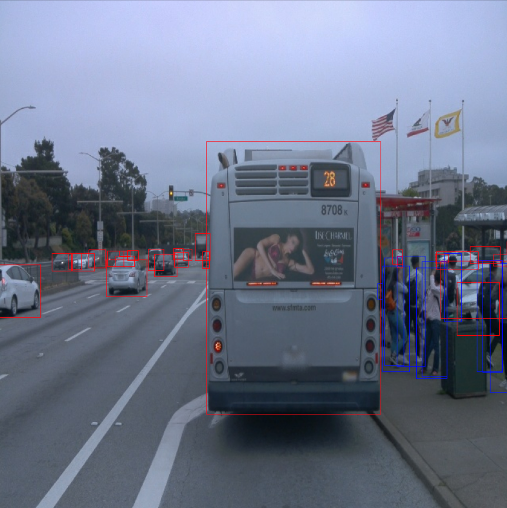
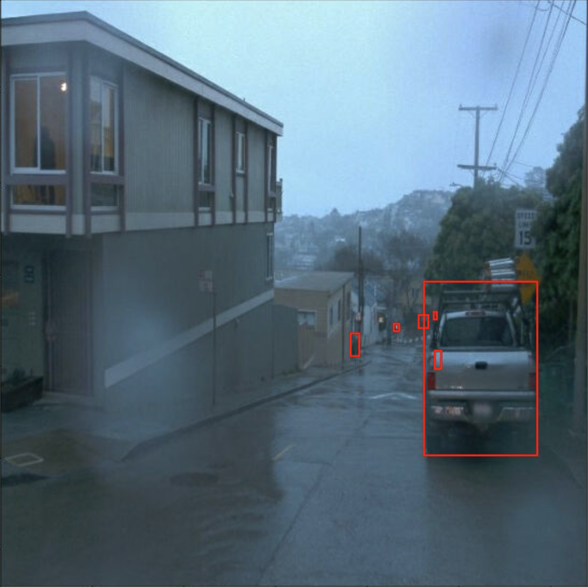
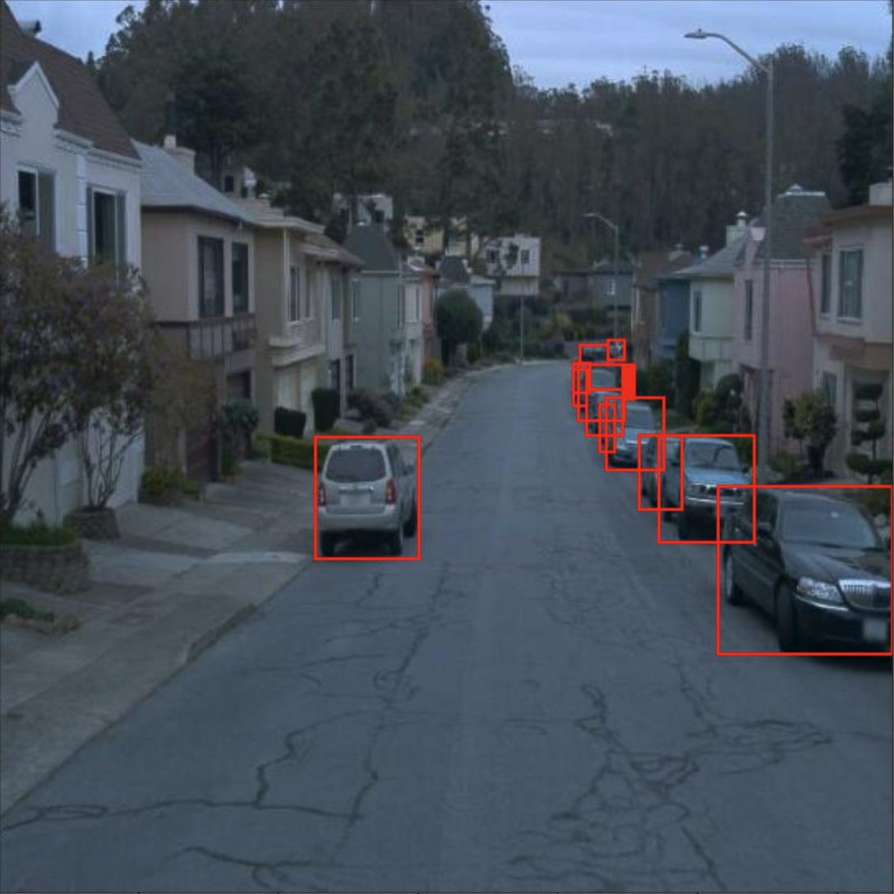

# Project: Object Detection in Urban Environment
Student: Monish Tandale

## Project Overview
The objective of this project is to develop a Deep Convolutional Neural Network to detect and classify objects found on an around roads in an urban environment using camera images only. This ability to detect obstacles is very critical for safe navigation of a self-driving car. The obstacles detected by the object detection module are then used as inputs to the motion planning module which generates a trajectory that the self driving car should follow to safely move towards the desired target state while avoiding all obstacles.

## Set Up
The setup for the code follows in the exact same manner as the [Instructions Provided for Project Setup by Udacity](https://learn.udacity.com/nanodegrees/nd0013/parts/cd2688/lessons/87953bff-bd73-420e-b07b-940cc9ceb138/concepts/ad1a8ada-4bb8-46b8-8143-40aedd57f7e1)  

## Dataset
### 1. Dataset Analysis
The following pictures show the training images and the ground-truth bounding boxes as labelled in the training dataset. Ten sample images are shown below. 

The images are taken in both commercial and residential urban settings. They contain a mix of vehicle and pedestrian obstacles labelled by red and blue bounding boxes respectively. The images are taken in various lighting conditions such as bright day, fogggy day and night. Some images also show blurry v/s sharp image quality.

The following figure shows the distribution of object classes across the training dataset. The images have a high percentage of vehicles, some pedestrians and very few cyclists. There are no signs marked as obstacles in the dataset. 

### 2. Cross-Validation
This project uses the hold out method of cross validation. The complete dataset is available as a collection of 99 .tfrecord files. These are randomly split into    
1. training set: 86 files
2. validation set: 10 files
3. test set: 3 files

The Single Sot Detector SSD-Resnet-50 640x640 pretrained model us used in this project for object detection. Training is performed using the images in the 86 files in the dataset and the hyperparameters for the training are modified under multiple training experiments. After  each training experiment, the trained model is evaluated using the validation dataset (images in 10 files) to determine performance metrics such as precision and recall. The model with the best precision and recall is picked and finally evaluated against the test dataset to determine model performance.   

## Training

The following figures show the training loss and the precision/recall metrics for the training conducted with the default hyperparameters provided in the project setup. The total training loss has a high value of 2.3 and the precision and recall values are close to 0 indicating poor object detection performance. This is further evidenced by the side-by-side image evaluations shown on TensorBoard where none of the obstacles in the image are detected.

### Reference Experiment
   
**Fig. Ref-Training**

**Fig. Ref-Loss**

   
**Fig. Ref-Precision**

   
**Fig. Ref-Recall**

  
**Fig. Ref-Evaluation Image**

### Improvement on Reference

To improve the model, the data augmentation methods and training hyperparameter changes listed below were applied.

#### Augmentations
The following data augmentation methods were added:
1. Random Image Scale
2. Random Pixel Value Scale
3. Random Horizontal Flip
4. Random Adjust Brightness
5. Random Adjust Contrast
6. Random Adjust Hue
7. Random Adjust Saturation
8. Random Black Patches
9. Random JPEG Quality 

Some sample images after data augmentations are presented below   

#### Update of Training Parameters
The Cosine Decay Learning Rate in the Momentum Optimizer was updated as follows

| Parameter | Reference Value | Updated Value |
|---|---|---|
| learning_rate_base | 0.04 | 0.001 |
| warmup_learning_rate | 0.01333 | 0.0001 |

After the improvement to the reference model, the training total loss reduced to 0.728. The precision and recall values are higher than the reference model, but there is significant room for improvement which can be achieved by further training. The side-by-side image evaluation also shows that some of the obstacles are accurately detected but there is room for improvement as some obstacles are not detected.   

   
**Fig. Imp-Training**

  
**Fig. Imp-Loss**

   
**Fig. Imp-Precision**

   
**Fig. Imp-Recall**

  
**Fig. Imp-Evaluation Image**

Comparison between Reference and Improved Training Experiment

| Criteria | Reference | Improved| 
|---|----|---|
| Learning Rate | 0.04 | 0.001
| Localization Loss | 0.87 | 0.42
| Classification Loss | 0.63 | 0.24
| Regularization Loss | 1.06 | 0.24
| Total Loss | 2.56 | 0.90

